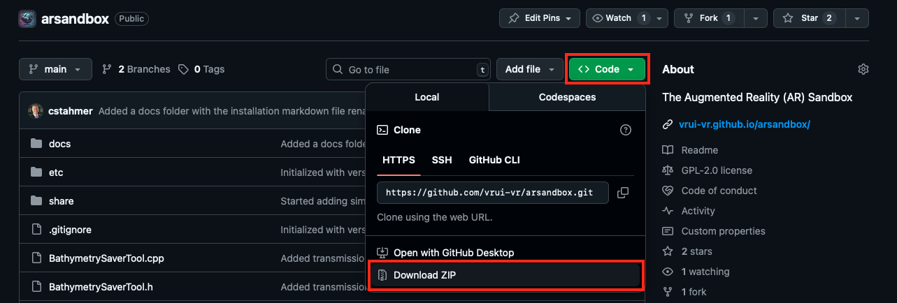

# Simple Augmented Reality Sandbox Installation guide

<!-- define abbreviations -->
*[ARSandbox]: Augmented Reality Sandbox

<!-- In the following, when asked to enter something into a terminal, each
line you are supposed to enter starts with a `$` denoting the
terminal's command prompt. Do *not* enter that `$`, but enter
everything that follows, and end each line by pressing the Enter key. -->

??? info "Heads up!"
    Angle brackets `<>` in commands below are placeholders, meaning that you have to replace everything between, and including, the angle brackets with some text that depends on your specific circumstances.

    For example, if your host has eight CPUs, instead of entering `-j<number of CPUs>` as part of some command, you would enter `-j8`.

## Step 1: Download the ARSandbox repository from GitHub

The ARSandbox code repository can be downloaded either by:

1. downloading the zip file and unpacking it **OR**
2. cloning the repository with `git clone`

!!! warning
    If you are unfamiliar with git and/or GitHub, you should probably go the zip file route.

### Option 1: Downloading and unpacking a zip file from GitHub

On [the ARSandbox repository's main page](https://github.com/vrui-vr/arsandbox), click on the green "<> Code" button, and then click on "Download ZIP" in the menu that pops up in response.



Depending on your browser settings, you may be asked where to store the file being downloaded, or it might be stored in a default location, such as your `Downloads` directory. Take note of what the zip file is called and where it is stored.

Assuming that you already created the `src` directory *according to Vrui's installation instructions*, enter the following line into a terminal window once the file is completely downloaded:

```sh
cd ~/src
```

Then enter into the same terminal window:

```sh
unzip <path to downloaded zip file>
```

Replace `<path to downloaded zip file>` with the full path to the zip file, for example `~/Downloads/arsandbox-main.zip`.

Finally, check for the name of your new ARSandbox directory by entering:

```sh
ls
```

which will list all files in the `src` directory, which should include a new directory called `arsandbox-main`. Take note of this name, and then enter into that directory by typing this command into the terminal window:

```sh
cd <ARSandbox directory>
```

where you replace `<ARSandbox directory>` with the name of the directory where you cloned/unpacked the ARSandbox in the previous step, as printed by `ls`.

### Option 2: Clone the repository from GitHub

Assuming that you already created the `src` directory *according to Vrui's installation instructions*, navigate to the `src` directory on your computer in the terminal window.

```sh
cd ~/src
```

Then, clone the repository from GitHub:

```sh
git clone https://github.com/vrui-vr/arsandbox.git
```

Finally, check for the name of your new ARSandbox directory by entering:

```sh
ls
```

which will list all files in the `src` directory, which should include a new directory called `arsandbox`. Take note of this name, and then enter into that directory by typing this command into the terminal window:

```sh
cd <ARSandbox directory>
```

where you replace `<ARSandbox directory>` with the name of the directory where you cloned/unpacked the ARSandbox in the previous step, as printed by `ls`.

## Step 2: Build the ARSandbox

!!! info "Heads up!"
    Make sure you are in the new `arsandbox-main` (from option 1) or `arsandbox` (from option 2) directory.

To build the ARSandbox, enter into the same terminal window:

```sh
make VRUI_MAKEDIR=<Vrui build system location>
```

where you replace `<Vrui build system location>` with the location of Vrui's build system on your host, as described in Vrui's installation instructions.

!!! example
    Your command will look something like this:

    ```
    make VRUI_MAKEDIR=/usr/local/share/Vrui-13.1/make
    ```

???+ tip
    You can **speed up the build process** if your host has multiple CPUs or CPU cores. Instead of the above, enter into the same terminal:

    ```
    make VRUI_MAKEDIR=<Vrui build system location> -j<number of cpus>
    ```

    again replacing `<Vrui build system location>` with the location of Vrui's build system on your host, and replacing `<number of cpus>` with the number of CPUs or CPU cores on your host, say `-j8` if you have eight cores. Note that there is no space between the `-j` and the number of cores.

    Using `-j$(nproc)` (exactly as written) will tell your computer to figure out how many cores it has.


Once `make` has finished running, check that there were no error messages. The quickest way to check whether the ARSandbox built successfully is to run the `make` command a second time, *exactly* as you entered it the first time.

If everything went well the first time, the second run will print:

```sh
make: Nothing to be done for 'all'.
```

<!-- !!! tip
    The easiest way to repeat a previous command is to press the "cursor up" key until the command appears on the command line, then press the Enter key. -->

## Step 3: Installing the ARSandbox

If built following these simple instructions, the ARSandbox *does not need to be installed.* You can run the built applications, `CalibrateProjector`, `SARndbox`, and `SARndboxClient`, directly from the directory where you cloned or unpacked the sources.

For example, to run the main ARSandbox application, you would enter the following into a terminal window:

```sh
cd <ARSandbox directory>
./bin/SARndbox
```

where you replace `<ARSandbox directory>` with the full name of the directory where you cloned/unpacked the ARSandbox sources, for example:

```sh
cd ~/src/arsandbox-main
./bin/SARndbox
```